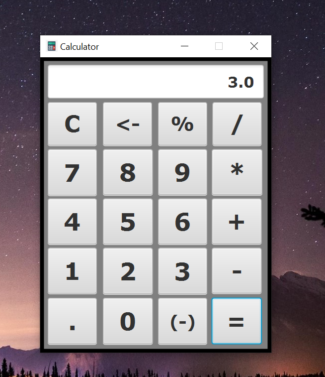

# Calculator
This is a super basic calculator that function like the hand held calculators, and does basic arithmetic.
The calculator does not factor in PEMDAS and instead will evaluate one expression at a time. For example, if you type  in "5 + 5 * 10" consecutively, it will evaluate the addition first since that is the first expression inputed and then will do the multiplication.

 It also prints every expression that it evaluates in the console. I coded this in Java and used the JavaFX library for the user interface.

Here is a screenshot of what it looks like:
